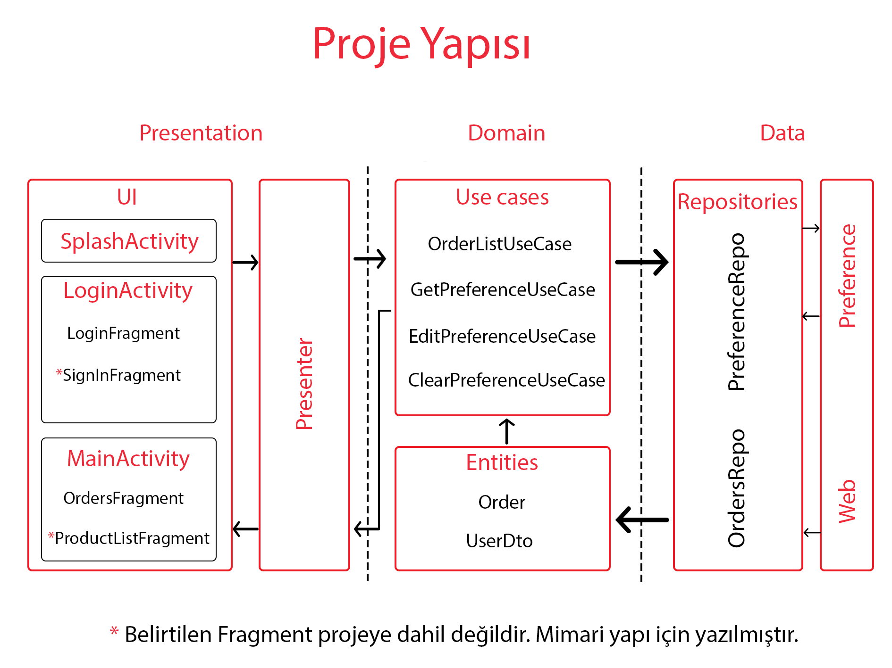

# Android Developer Challenge
Android Tech Challenge yarışmasında ikinci tur için belirli kurallar ve kriterlere bağlı kalarak geliştirilmiş bir Market uygulamasıdır.

- - - -
## Proje Hakkında

### Splash Ekranı

* Kullanıcı  uygulamaya ilk kez giriyor veya uygulamadan çıkış yapmış veya giriş yaparken beni hatırla seçilmedi ise Giriş ekranına yönlendirilmesi.
* Kullanıcı adı ve Şifre ile daha önceden beni hatırla seçildi ise kullanıcının  *servisten (fonksiyon ile yapılmıştır) tekrar sorgulanması ve uygulamaya yönlendirilmesi.
* *Servisten (fonksiyon ile yapılmıştır) kullanıcı doğrulanmadığında kullanıcıya “Kullanıcı bilgileriniz doğrulanamadı. Giriş Ekranına yönlendiriliyorsunuz.” Mesajı gösterilir ve  Giriş ekranına yönlendirilmesi.

### Giriş Ekranı

* Kullanıcı adı ve Şifre ile kullanıcının uygulamaya yönlendirilmesi.
* Kullanıcı adı olarak “kariyer” ve Şifre olarakta “2019ADev” belirlendi.
* Kullanıcı adı veya Şifre alanları boş ise “Kullanıcı adı veya Şifre alanları boş olamaz.”  mesajı gösterilir.
* Kullanıcı adı veya Şifre hatalı ise “Kullanıcı adı veya Şifre hatalı.”  mesajı gösterilir.
* Kullanıcı “Beni Hatırla” seçeneğini seçerek ile bir sonraki girişlerde direkt olarak uygulamaya yönlendirilir.

### Siparişlerim Ekranı

* Servisten gelen siparişlerin listelenmesi.
* Market ismi birden fazla satır olma ihtimaline göre hücre yapısı tasarlandı.
* Sipariş ismi ekrana sığmadığı durumda … ile kesilcek şekilde hücre yapısı tasarlandı.
* Sipariş durumu kullanıcı deneyimi için renkli şekilde gösterilir.
* Ürün detaylarını aşağıya doğru açılacak şekilde tasarlandı.
* Görüntülenen ürün detayları kaydırma yapılması veya ekran döndürülmesi durumunda açık olan kartların açık, kapalı olan kartlarında kapalı olacak şekilde geliştirildi.
* Uygulamada beklenmeyen hata ile karşılaşıldığında kullanıya “Uygulamada bir hata tespit ettik. Tekrar Deneyin.” mesajı gösterilir ve işlem tekrarlanır

### Ana Ekran

* Çıkış Butonu ile kullanıcıya “Çıkış yapmak istediğinize emin misiniz?” mesajı ile onay istenir ve onaylanması durumunda kullanıcıyı Giriş Ekranına yönlendirilir.

### Gereksinimler
* JDK 8
* Android SDK API 29
* Kotlin Gradle plugin 1.3.41
### Yapılandırmalar
* Uygulama Android 4.4 ve üzeri için geliştirilmiştir.
* minSdkVersion=19
* targetSdkVersion=29

## Projenin Yapısı

## Projenin Mimarisi
Proje Clean Architecture mimarisi ile geliştirildi ve  MVP Architecture ile optimize edildi. Bu mimari ile kullanıcı arayüzü, verilerin çekildiği katman ve bu iki katmanın iletişimin sağlayan katman olan içerik sağlayıcı birbirinden izole edildi. Dagger2, RxJava ve Retrofit 2 gibi en yeni ve en popüler teknolojileri kullanıldı.

Mimari Hakkında daha fazla bilgi için [Clean Architecture](https://blog.cleancoder.com/uncle-bob/2012/08/13/the-clean-architecture.html) adresinden ulaşabilirsiniz.

## Kullanılan Kütüphaneler
* [Dagger 2](https://dagger.dev/) - Android için sınıf ya da bağımlılıkları yönetmemizi sağlayan kütüphanedir.
* [RxJava 2](https://github.com/ReactiveX/RxJava/wiki/What%27s-different-in-2.0) -  Asenkron işlemler için kullanılan güçlü bir kütüphanedir.
* [Retrofit 2](https://square.github.io/retrofit/) ve [Okhttp3](https://square.github.io/okhttp/) - Android için güvenli bir HTTP istemci kütüphanesidir.